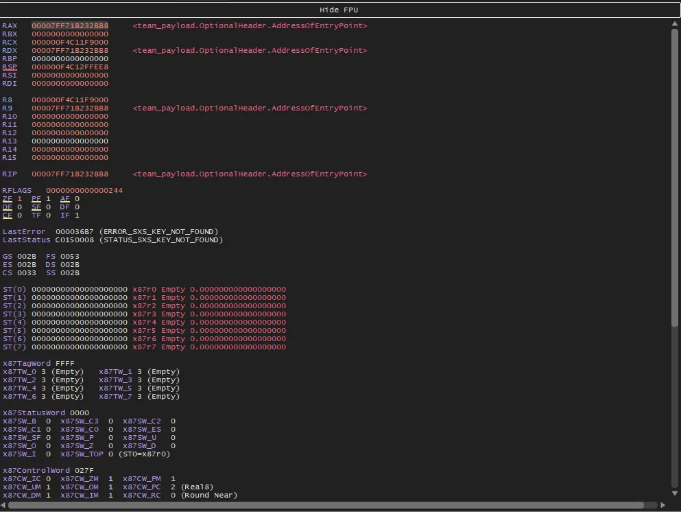
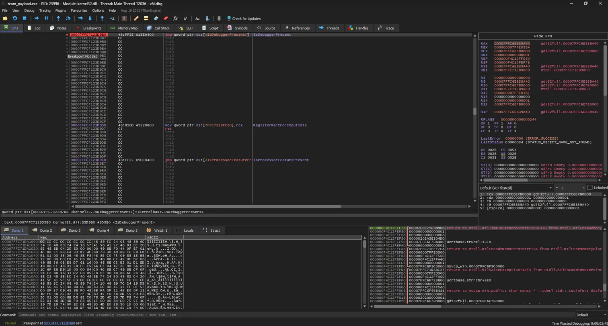
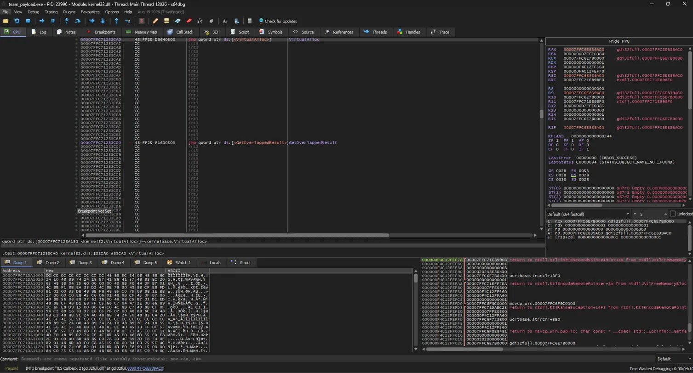
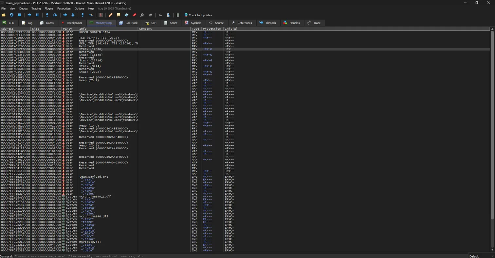
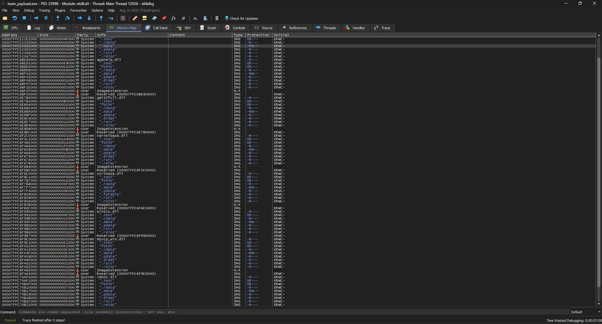
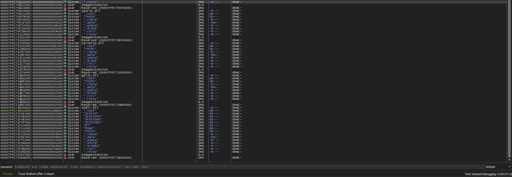

# Análisis Dinámico y de Memoria — team_payload.exe

**Herramienta:** x64dbg  
**Fecha:** 05 de mayo de 2026

---

## Entry Point

Al cargar el binario en x64dbg, la ejecución se pausó automáticamente antes de ejecutar cualquier instrucción del programa.

- **RIP:** `00007FF71B232BB8`
- Apunta a `team_payload.OptionalHeader.AddressOfEntryPoint`
- Los registros RAX, RDX y R9 apuntaban todos a la misma dirección, confirmando el inicio limpio del proceso

---

## Breakpoints Analizados

### IsDebuggerPresent — Anti-Debugging

El binario llama a `IsDebuggerPresent` durante su ejecución. Esta función de la API de Windows retorna `TRUE` si el proceso está corriendo bajo un debugger, lo que permite al programa detectar que está siendo analizado y alterar su comportamiento.

- Breakpoint activado en `kernel32.dll`
- Dirección: `00007FFC7123D9B0`
- Instrucción observada: `jmp qword ptr ds:[<IsDebuggerPresent>]` (salto a través de la IAT)

Esta técnica es ampliamente usada en malware real para evadir análisis forense. Su presencia en el binario simula fielmente ese comportamiento evasivo.

---

### VirtualAlloc — Reserva de Memoria RWX

El binario llama a `VirtualAlloc` para reservar una región de memoria en tiempo de ejecución.

- Breakpoint activado en `kernel32.dll`
- Dirección: `00007FFC71233CA0`
- Instrucción observada: `jmp qword ptr ds:[<VirtualAlloc>]` (salto a través de la IAT)

**¿Por qué es relevante?**

`VirtualAlloc` permite especificar los permisos de la región de memoria que se reserva. Cuando se utiliza el flag `PAGE_EXECUTE_READWRITE` (valor `0x40`), la región resultante tiene permisos de lectura, escritura **y ejecución simultáneamente** — lo que se conoce como región **RWX**.

Una región RWX es peligrosa porque permite:
1. **Escribir** código arbitrario (shellcode) en esa región
2. **Ejecutarlo** directamente desde memoria, sin necesidad de escribir nada en disco

Este es el mecanismo central detrás de técnicas como carga dinamica de codigo, ejecucion en memoria y malware fileless. El binario simula esta reserva de forma segura — la memoria se reserva pero no se escribe ni ejecuta código malicioso en ella.
La llamada ocurre unicamente despues de validar correctamente la contraseña ingresada por el usuario

Las soluciones EDR modernas y reglas YARA utilizan este tipo de llamadas como indicadores comunes de comportamientos sospechosos.

---

## Memory Map

Se examinó el mapa de memoria completo del proceso durante la ejecución.

### Secciones del binario

| Sección | Protección | Descripción |
|---|---|---|
| `.text` | ER---- | Código ejecutable del programa |
| `.rdata` | -R---- | Strings y datos de solo lectura |
| `.data` | -RW--- | Variables globales del programa |
| `.reloc` | -R---- | Tabla de reubicación del PE |

Las protecciones son normales para un ejecutable C++ compilado con MSVC. No se observaron secciones con permisos RWX en el PE base, lo que indica que la memoria ejecutable se reserva dinámicamente en tiempo de ejecución mediante `VirtualAlloc`.

### DLLs cargadas

Durante la ejecución se cargaron las siguientes librerías del sistema:
`ntdll.dll`, `kernel32.dll`, `kernelbase.dll`, `gdi32full.dll`, `ucrtbase.dll`, `vcruntime140.dll`, `win32u.dll`, `msvcp_win.dll`, `apphelp.dll`

---

## Conclusión

El análisis dinámico confirmó dos técnicas ofensivas simuladas en el binario:

1. **Anti-debugging basico** mediante `IsDebuggerPresent` — el binario detecta activamente la presencia de un debugger, comportamiento común en malware que intenta evadir análisis.

2. **Reserva de memoria RWX** mediante `VirtualAlloc` — el binario solicita memoria con permisos de ejecución en tiempo de ejecución, simulando patrones comunmente asociados a ejecucion dinamica de codigo en memoria y malware fileless.

Ambas técnicas, aunque implementadas de forma segura y controlada, replican patrones reales que serían detectados por herramientas EDR, reglas YARA y soluciones antivirus modernas.
